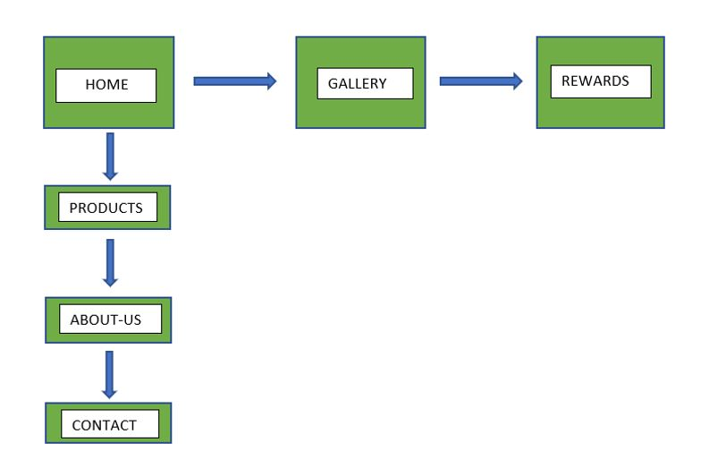

# Foley's Of Duleek - Brian Stritch 2021 Project-1

Foley's of Duleek is a website that hopes to encourage locals to shop local and in turn by buying products at Foley's, locals are purchasing locally produced products. The website is targeted at the general public who would like to eat healthy, consuming locally sourced organic meat products, which in turn helps keep the community stable by sourcing within the local area and serving back to the community.

Foley's of Duleek website is a showcase of the products offered within the butcher shop and gives the user a general backround of the source of the organic products on offer and provides the user with a link to wikipedia in each meat sectio to the relevant content. Also included in the website is a brief overview of the alternative products on offer such as pre-packaged, frozen foods and dry foods and condiments.

Additionally Foley's of Duleek offers a rewards scheme to loyal customers who collect rewards points during every shop which can be redeemed within the shop in further discounts and members only special offers, and the attached form provides a customer a means to sign up and join the scheme.

## Features 
1. The Home Page - The home landing page provides the user with a background image of cooked meat being sliced on a wooden chopping board, instantly being recognisable as a food based website. On larger screens the initial page displays four tabs across the lower section of the page displaying four different meat selections.

2. Meat Selectors - The Meat Selectors on the main landing page act as links to take the user to the relevant section of information relating to their selection.

3. Our Products - The Our Products section showcases the types of meat products offered by Foley's of Duleek and contains the information relating to the specified meat product and provides a specific link below each description, which should the user wish to learn more will redirect the user to wikipedia in a new tab. The Link to redirect the user to Wikipedia is purposely designed with a small font size as to not grab the attention of the user, in an attempt to retain their focus on our website and not to leave. 

4. Pre-Packaged Products- The pre-packaged foods range gives a brief description of products which are pre-packaged such as Coleslaw products, Potato products etc. Which require to be kept in a refrigerator. 

5. Frozen Food Range - The Frozen food range gives a brief description of a number of frozen products offered in store which may compliment the fresh meats on offer.

6. Dry Foods and Condiments - The Dry foods and Condiments range gives a brief description of alternative products on offer such as garnish, sauces and seasonings. This range also includes dried foods such as rice and pasta and covers canned foods also.

7. Special Offers - The Special Offers section gives a description of the main special offer meat bundles available at the time of creating this website.

8. Know Your Cuts - This section is designed to educate the user in respect of which cuts of meat come from which section of the animal and hand drawn illustrations which clearly illustrate the specific cuts for each section. i.e round steak, rump roast, hock etc.

9. About Us - The About us section gives a brief description of the butcher shop and their beliefs.

10. Contact Us - The Contact us section provides the user with the relevant contact information such as the contact number, email, address and a google maps section which can be selected to redirect the user to google maps providing navigation to the shop.

11. Gallery - The gallery is on a seperate page to the Home page and showcases some apetising cooked and raw meat products for the user to find inspiration in which products they wish to choose. this section also includes multiple Media portals where educational videos can be viewed directly from youtube which directly correlate with the organic meat products on offer.

12. Rewards - The rewards page is on a seperate page to the Home page and Gallery page ,and is a general signup page where the user can apply for membership to the loyalty rewards scheme where a return on their purchases is obtained by means of accumlating rewards points.

### Existing Features

- __Navigation Bar__

  - Featured on all three pages, the full responsive navigation bar includes links to the Logo, Home page, Products, Special Offers, About, Contact, Gallery and Sign Up pages and is identical in each page to allow for easy navigation. 

  - A Burger icon menu navigation menu is also implemented and whilst at the top of the page the Burger navigation is hidden from view behind the page header and on scrolling down the page the burger icon reveals itself and remains fixed to the top right corner of the screen. The purpose of chosing the burger icon menu over a sticky header was to increase viewport size for the user and still allowing the user to access any area of the website by simply selecting the desired location. On larger screens the burger menu remains hidden at the top of the screen and to activate the dropdown menu the user must simply hover over the icon. 

  - On Devices with a width less than 1200px wide the navigation bar the navigation bar is designed to be hidden and the burger menu shows itself above the header and remains in the upper right corner at all times. The burger icon navigation menu at this device screen width and below is set to "onclick" for the purposes of being operated on tablets and mobile phones where the user would be unable to hover over the link. 

  - All navigation links are set to have a color change and a subtle box-shadow to show the user which link is being hovered over prior to selection.The above navigation type selection will allow the user to easily navigate from page to page and to specific sections across all devices without having to revert back to the previous page via the ‘back’ button. 

  - The navigation is set to scroll smooth so the user is aware that they have remained on the same page but have been redirected to a different section and the smooth action gives a positive experience to the user. 

- Above it can be noted that the Burger Navigation menu is hidden behind the header.
- Below is the Burger Navigation menu taken from a smaller device where the menu requires onclick to open and a second click to close. 
- On larger screens the Burger Navigation menu is set to display its contents when the mouse is hovered over the icon.

- __The landing page image__

  - This section allows the user to instantly recognise that this is a food based website due to the image of a piece of cooked meat being cut on a wooden chopping board, and the main hero image text overlay indicates that this is in fact a butchers website where such a piece of meat would be readily available for purchase. 

- __Products-selectors__

  - The products selectors are intentionally designed to be visible at the lower area of the landing image, therefore prompting the user to scroll down the page. The images chosen for the selectors were chosen due to their appeal as they would be very appetising and would instantly draw the attention of the user, which allows the user to select a product and the link embedded within will redirect them to the relevant section on the page.

- __Our-Products__

  - This section will allow the user to see exactly when the meetups will happen, where they will be located and how long the run will be in kilometers. 
  - This section will be updated as these times change to keep the user up to date. 

- __Pre-packaged food, Frozen Foods, Dry Foods and Condiments__

  - This section will allow the user to see exactly when the meetups will happen, where they will be located and how long the run will be in kilometers. 
  - This section will be updated as these times change to keep the user up to date. 

- __Special Offers__

  - This section will allow the user to see exactly when the meetups will happen, where they will be located and how long the run will be in kilometers. 
  - This section will be updated as these times change to keep the user up to date. 

- __Know your Cuts__

  - This section will allow the user to see exactly when the meetups will happen, where they will be located and how long the run will be in kilometers. 
  - This section will be updated as these times change to keep the user up to date. 

- __About Us__

  - This section will allow the user to see exactly when the meetups will happen, where they will be located and how long the run will be in kilometers. 
  - This section will be updated as these times change to keep the user up to date. 

- __Contact Us__

  - This section will allow the user to see exactly when the meetups will happen, where they will be located and how long the run will be in kilometers. 
  - This section will be updated as these times change to keep the user up to date. 

- __The Footer__ 

  - The footer section includes links to the relevant social media sites for Love Running. The links will open to a new tab to allow easy navigation for the user. 
  - The footer is valuable to the user as it encourages them to keep connected via social media

- __Gallery__

  - The gallery will provide the user with supporting images to see what the meet ups look like. 
  - This section is valuable to the user as they will be able to easily identify the types of events the organisation puts together. 

- __The Sign Up Rewards Page__

  - This page will allow the user to get signed up to Love Running to start their running journey with the community. The user will be able specify if they would like to take part in road, trail or both types of running. The user will be asked to submit their full name and email address. 

For some/all of your features, you may choose to reference the specific project files that implement them.

In addition, you may also use this section to discuss plans for additional features to be implemented in the future:

### Features Left to Implement

- Sales page 

## Testing 

In this section, you need to convince the assessor that you have conducted enough testing to legitimately believe that the site works well. Essentially, in this part you will want to go over all of your project’s features and ensure that they all work as intended, with the project providing an easy and straightforward way for the users to achieve their goals.

In addition, you should mention in this section how your project looks and works on different browsers and screen sizes.

You should also mention in this section any interesting bugs or problems you discovered during your testing, even if you haven't addressed them yet.

If this section grows too long, you may want to split it off into a separate file and link to it from here.

### Validator Testing 

- HTML
  - No errors were returned when passing through the official [W3C validator](https://validator.w3.org/nu/?doc=https%3A%2F%2Fcode-institute-org.github.io%2Flove-running-2.0%2Findex.html)
- CSS
  - No errors were found when passing through the official [(Jigsaw) validator](https://jigsaw.w3.org/css-validator/validator?uri=https%3A%2F%2Fvalidator.w3.org%2Fnu%2F%3Fdoc%3Dhttps%253A%252F%252Fcode-institute-org.github.io%252Flove-running-2.0%252Findex.html&profile=css3svg&usermedium=all&warning=1&vextwarning=&lang=en#css)

### Unfixed Bugs

You will need to mention unfixed bugs and why they were not fixed. This section should include shortcomings of the frameworks or technologies used. Although time can be a big variable to consider, paucity of time and difficulty understanding implementation is not a valid reason to leave bugs unfixed. 

## Deployment

This section should describe the process you went through to deploy the project to a hosting platform (e.g. GitHub) 

- The site was deployed to GitHub pages. The steps to deploy are as follows: 
  - In the GitHub repository, navigate to the Settings tab 
  - From the source section drop-down menu, select the Master Branch
  - Once the master branch has been selected, the page will be automatically refreshed with a detailed ribbon display to indicate the successful deployment. 

The live link can be found here - https://brianstritch.github.io/Brian-Stritch-Foleys-P1-Project-2021/ 

## Credits 

- I would like to thank ALan Foley for allowing me to base this website on his butchers, and allowing me to obtain images of the shop and for the time spent discussing the text content.
- I would like to thank my mentor Maranatha llesanmi for the guidance throughout the project.
- I would like to credit Kevin Powell youtuber for numerous educational tutorials regarding the positioning and layout of this site.
- I would like to thank all my family and friends for the help in testing the website searching for errors and bugs.

In this section you need to reference where you got your content, media and extra help from. It is common practice to use code from other repositories and tutorials, however, it is important to be very specific about these sources to avoid plagiarism. 

You can break the credits section up into Content and Media, depending on what you have included in your project. 

### Content 

- The text contents throughout the whole site were written by me and inspired by a combination of numberous butchers websites worldwide and through discussions with Alan Foley of Foley's of Duleek.
- Instructions on how to implement form validation on the Sign Up page was taken from the love running code institute walkthrough.
- The burger menu was sourced via google search and found on w3 schools website.
- The icons in the footer were taken from [Font Awesome](https://fontawesome.com/)
- The illustration images of the animals were drawn by my daughter Clodagh. 

### Media

- The photos used on the home, gallery and sign up page are from This Open Source sites pexels.com and pixabay.com
- The images used for the meat cuts illustrations were hand drawn by my daughter Clodagh.
- The images in the frozen food , dry foods ,pre packaged foods and the about us sections were taken by me in person.
- The video content was obtained from You tube and embedded in the site.
- The audio recording in the gallery page was recorded by me.

 ## __UX__

- ### __Scope__
 - From Why to What!
  - What they say they need
    - To display the fresh meat products on offer
    -	Advertise the special offers
    -	To educate prospective clients on organic meats
    -	To display images of products similar to what is on offer
    -	Advertise a rewards scheme for loyal customers
  - What they actually need:
    -	A responsive website suitable for viewing on desktop and mobile devices.
    -	A contact Us area and map for location.  
  - What they dont know they need:
    -	A gallery of Images of products to entice clients. 
    -	A video gallery outlining the different organic products. 
    -	A rewards sign-up form for loyal customers
    -	Links to social media 

      ###__Features and Content__
         - example: A user wishes to sign up to the loyal customers rewards scheme, a rewards sign up form with a submit option would be required for this function to take place. 
        - 
    

- ### __Strategy__
  -	To create a website to showcase the butcher shop.
  -	The ability to browse the special offers in store.
  -	The aim is to generate more exposure of the butcher shop and the products and services available.
  -	Foley’s Butchers would like to educate the public in organic products.
  -	To introduce a new social media following for updates on the special offers in store.
  -	To showcase a gallery of images of appetising foods.
  -	To provide the public with knowledge of the areas of the animals to which each cuts originate.
 - ### __Relevance of Content__
        - The content will be relevant, as the type of products on offer are a weekly purchase in nearly every household, and the site will be aimed at all age groups as products are available for all different taste buds. The site will be easy to navigate, it will be click and go to where you want to get to. The majority of the website will be structured on the one page so scrolling up and down will be smooth and seamless, with the addition of a gallery page and a rewards sign up form.

 - ### __Why is it special__    
        - Foley’s of Duleek are special in that they offer premium quality local and irish products which are Organically farmed and full traceability. They provide a specialist cuts service where the consumer can select the cuts of their choice, with an area of the website dedicated to educating the consumer in the location of the specific cuts of the animal carcass. 
        Foley’s offer seasonal special offers and can provide meat packs for corporate barbeque and dinner events on request. Whole carcass deals can be requested on contacting Foleys.
        At Foley’s loyal customers are rewarded with a loyalty rewards scheme where the consumer can accumulate points with every purchase and avail of further discounts and special offers only available to members.
       - Future Developments of the website will include an online purchasing and delivery service for all the products on offer.  A members area or forum will also be created so members can interact and use it to monitor the rewards points collected and to exchange the rewards points for discounts and members only offers, and also for publishing their own recipes for sharing with other members. A strategic research process will be enacted to get as many views as possible as to how we can instil the required content for the user. 
 - ### __What makes a great experience__
        1.	The ability to view all your favourite products in the one place. 
        2.	Having the personal choice of which meat’s you want to buy. 
        3.	The ability to collect rewards points as you shop for future discounts and special rewards offers. 
        4.	When the members area is up and running, it will act as a meeting point for Loyal rewards members who can share recipes. 
        5.	Being able to purchase all your favourite meats carved to your liking and delivered to your door. 
    - ### __What can a user expect?__
        - __Does it offer me what I want__
          - Yes, to have the function to be able to view all the local and  organic products on offer. 
        - __As a user I expect to see__
          - Visually, the main meat types and other relevant food content e.g. some pre-packaged foods, frozen foods range, dry foods and condiments range, and special offers. The website also provides a background story on the sourcing of the products available.
        - __Can I contact somebody?__ 
          - Yes, there is a contact us area where you can sign up for rewards membership, or they can contact the shop via the contact numbers, email or social media links found in the footer. 
        - __What can I learn?__ 
          - The website houses a specific section dedicated to illustrating the different cuts on the carcass, and a descriptive section outlining the source of each product and a further video gallery for organic farming related content. 

 - ### __Structure__
    - __Information Architecture (IA)__ 
      A basic tree structure layout . 
        - 
  - __Interaction Design (IXD)__ 
    - The first area the user will encounter is the Home page, where the navigation bar is located at the top right of the      page. The navigation bar is found at the top of all the pages of the website. Each link in the main navigation bar is clearly marked out with a hover feature so the user can clearly see which items they are selecting. 
    - An additional hamburger icon navigation menu is fixed to the screen in the upper right corner, which is hidden behind the main navigation bar when at the top of the page, so as to not confuse the user, but on scrolling down the page it reveals itself and remains in place allowing the user to navigate to anywhere in the website without restricting the viewport height allowing for a more pleasurable experience. When the user hovers their mouse over the hamburger menu on larger screens a dropdown menu appears allowing the user to navigate to the area of their liking.
    - On mobile devices the main navigation bar disappears, and the hamburger menu comes forward to sit above the header and is always in full sight of the user. It is located to the top-right of the screen in the same position as it is found on larger screens. This when pressed drops the navigation menu so the user can select their destination within the website. Each link is clearly marked out with a hover feature so the user can clearly see which link is being selected. 
    - On desktop each navigation link has a gentle hover to show that the area is active and the active page has an underline indicating which page the user is currently on. Once clicked or pressed the link will smoothly take the user to whichever section they desire. 
              The gallery and video areas are close together for easy access to jump from one to another. The media player will play clips of videos on you tube which directly relate to the sourcing of the products for the shop. An audio file has been included thanking the user for visiting the website and requests that the user visit the shop. The user has control over the play, pause rewind, fast-forward and volume functions.
    - The site includes hyperlinks to external sources on Wikipedia for additional information which relates to the content found in this website.
              The site also incorporates a rewards page which includes a sign up form which gathers data via the input fields and submits the data to the code institute database and returns a table of the contents gathered. The sign up form also includes a clear button which clears all the data fields.
              Each social media link also has a hover effect so the user knows the link is active and it will take the user to the relevant platform requested. 
 - ### __Skeleton__

    - Below is a set of wireframes created on balsamiq illustrating the index, gallery and rewards pages of the website.
      - The index Page
      - 
      - The Gallery Page
      - 
      - The Rewards Signup page
      - 
 

  

Congratulations on completing your Readme, you have made another big stride in the direction of being a developer! 

## Other General Project Advice

Below you will find a couple of extra tips that may be helpful when completing your project. Remember that each of these projects will become part of your final portfolio so it’s important to allow enough time to showcase your best work! 

- One of the most basic elements of keeping a healthy commit history is with the commit message. When getting started with your project, read through [this article](https://chris.beams.io/posts/git-commit/) by Chris Beams on How to Write  a Git Commit Message 
  - Make sure to keep the messages in the imperative mood 

- When naming the files in your project directory, make sure to consider meaningful naming of files, point to specific names and sections of content.
  - For example, instead of naming an image used ‘image1.png’ consider naming it ‘landing_page_img.png’. This will ensure that there are clear file paths kept. 

- Do some extra research on good and bad coding practices, there are a handful of useful articles to read, consider reviewing the following list when getting started:
  - [Writing Your Best Code](https://learn.shayhowe.com/html-css/writing-your-best-code/)
  - [HTML & CSS Coding Best Practices](https://medium.com/@inceptiondj.info/html-css-coding-best-practice-fadb9870a00f)
  - [Google HTML/CSS Style Guide](https://google.github.io/styleguide/htmlcssguide.html#General)

Getting started with your Portfolio Projects can be daunting, planning your project can make it a lot easier to tackle, take small steps to reach the final outcome and enjoy the process! 